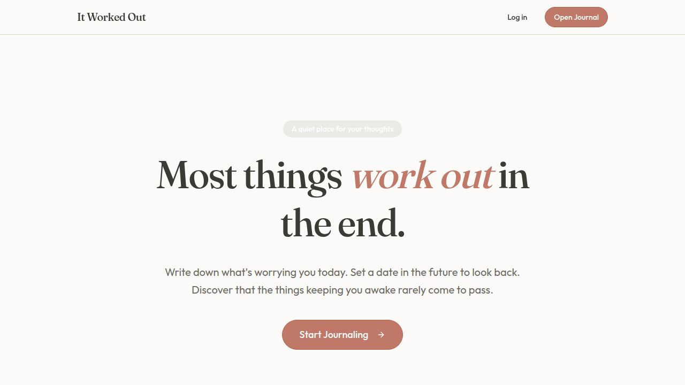

<h1 align="center">🌱 It Worked Out</h1>

<p align="center">
  <em>A quiet web app for the worries you carry around. Write them down, set a date to look back, and notice how many of them quietly resolved themselves.</em>
</p>

<p align="center">
  <a href="https://lakemauer.com">
    
  </a>
  
  
</p>

<p align="center">
  
</p>

---

## ✨ What it is

**It Worked Out** is a reflective journaling app for anxiety. The premise is simple:

1. **Write it down.** Type what's stressing you out today.
2. **Pick a future date** when you think the worry will be resolved.
3. **Reflect** when that date arrives — did it work out, or are you still stressing?

Over time you build a tangible record of how often your worst-case predictions never came true. It's not toxic positivity — bad things do happen — but our brains are biased toward threat detection, and a journal of resolved worries is a small antidote to that.

> Live at **[lakemauer.com](https://lakemauer.com)** &nbsp;·&nbsp; built &amp; maintained by [Lake Mauer](https://www.linkedin.com/in/lake-mauer/).

## 🛠 Tech stack

| Layer | Tool |
|---|---|
| Frontend | React 19, Vite, TypeScript |
| Routing | Wouter |
| State / data | TanStack Query |
| UI kit | shadcn/ui (Radix + Tailwind v4) |
| Forms | React Hook Form + Zod |
| Database | Supabase Postgres |
| API | Express 5 (health checks) |
| Hosting | Azure Static Web Apps + GitHub Actions |
| Analytics | Google Analytics 4 |

## 📁 Project structure

```text
It-Worked-Out/
├─ artifacts/
│  ├─ it-worked-out/        # the React/Vite frontend (the actual web app)
│  │  ├─ src/
│  │  │  ├─ pages/          # home, app/journal, about, privacy, cookies, terms
│  │  │  ├─ components/     # cookie-consent, footer, page-shell, shadcn ui/
│  │  │  ├─ hooks/          # use-entries, use-toast
│  │  │  └─ lib/            # supabase client, helpers
│  │  ├─ public/            # favicon, OG image, resume PDF
│  │  └─ index.html         # meta tags, GA, fonts
│  └─ api-server/           # tiny Express server (currently /api/healthz only)
├─ .github/workflows/       # Azure Static Web Apps CI/CD
├─ pnpm-workspace.yaml      # monorepo definition
└─ README.md
```

## 🚀 Run it locally

You'll need **Node 20+** and **pnpm 10+**.

```bash
# 1. Clone
git clone https://github.com/lakem4/It-Worked-Out.git
cd It-Worked-Out

# 2. Install deps for the whole monorepo
pnpm install

# 3. Set up Supabase env vars for the frontend
cp artifacts/it-worked-out/.env.example artifacts/it-worked-out/.env
# Then edit the .env file and fill in:
#   VITE_SUPABASE_URL=https://<project>.supabase.co
#   VITE_SUPABASE_ANON_KEY=<your anon key>

# 4. Run the dev server
pnpm --filter @workspace/it-worked-out run dev
# → opens http://localhost:5173
```

## 🌐 Database setup

The app expects a single Supabase Postgres table called `stress_entries`:

```sql
create table stress_entries (
  id               uuid primary key default gen_random_uuid(),
  description      text not null,
  logged_date      date not null,
  reflection_date  date not null,
  status           text not null default 'pending'
                   check (status in ('pending','worked_out','still_stressing')),
  created_at       timestamptz not null default now(),
  updated_at       timestamptz not null default now()
);

alter table stress_entries enable row level security;
create policy "Allow all" on stress_entries
  for all using (true) with check (true);
```

> ⚠️ The current deploy uses an open RLS policy because there's no auth — every visitor reads every entry. If you fork this, add Supabase Auth before opening it up.

## 📦 Build &amp; deploy

The site auto-deploys to Azure on every push to `main` via [`.github/workflows/azure-static-web-apps.yml`](.github/workflows/azure-static-web-apps.yml). You can build locally with:

```bash
pnpm --filter @workspace/it-worked-out run build
# → static output in artifacts/it-worked-out/dist/public
```

## 🗺 Roadmap

- [ ] Per-user accounts (Supabase Auth) so entries aren't globally shared
- [ ] Email/SMS reminders when a reflection date arrives
- [ ] Insights dashboard: percent of worries that worked out, time-to-resolve, recurring themes
- [ ] Mobile PWA install

## 📄 License

MIT &mdash; do whatever, just don't blame me.

## 👋 About the author

Built by **Lake Mauer**, a Business Analytics &amp; Information Systems student at the University of Iowa. Find me at:

- 🌐 [lakemauer.com](https://lakemauer.com/about)
- 💼 [LinkedIn](https://www.linkedin.com/in/lake-mauer/)
- 📧 [lakemauer@gmail.com](mailto:lakemauer@gmail.com)
